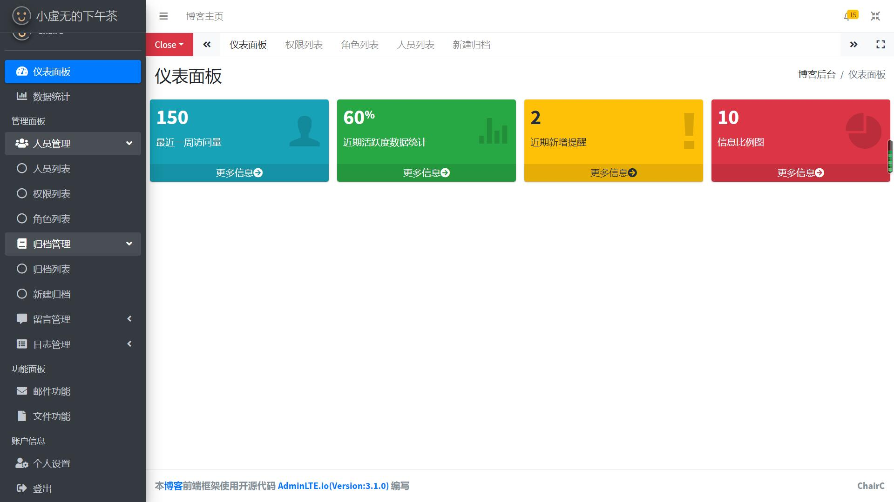
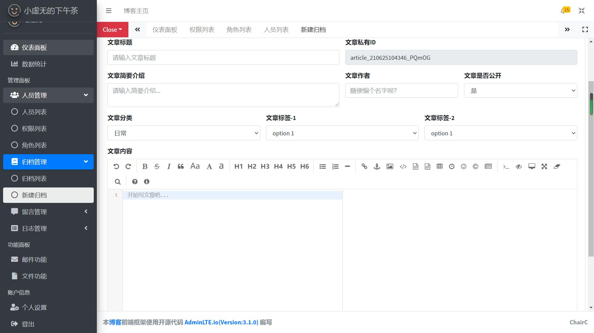
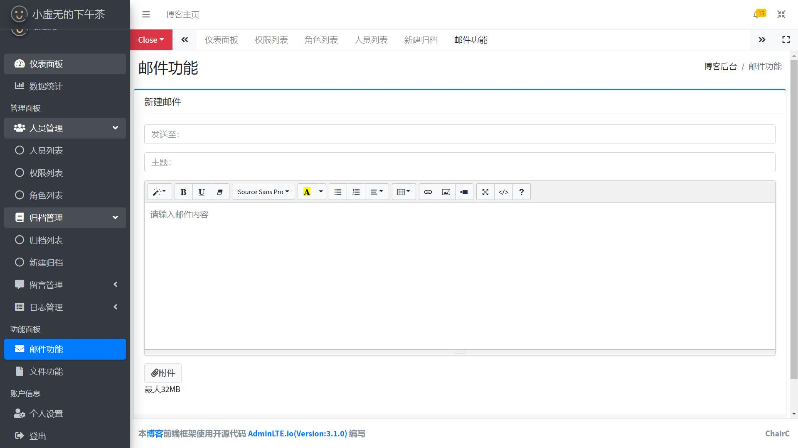
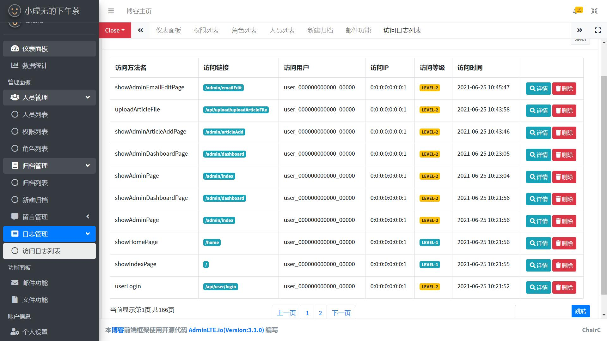
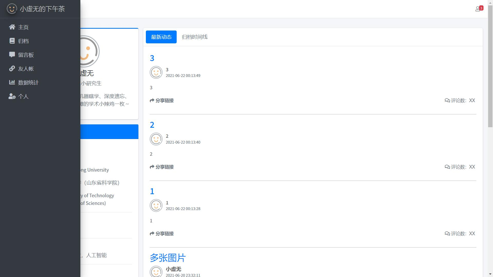

# 关于CC博客计划
该博客项目分为old-cc-blog和new-cc-blog两块，其中old为第一代博客系统<-太简陋了！目前第二代正在重新编写，预计2021年8月发布1.0版本。

## 关于博客技术框架
1. 基础技术框架： Springboot (Version:2.4.5)
2. 前端框架模板： AdminLTE.io (Version:3.1.0)
3. 安全框架： Shiro-Springboot (Version 1.6.0)
4. 富文本编辑框架：editor.md
5. 数据持久层： Mybatis-Springboot (Version 1.3.2)
6. 数据库服务： MySQL (Version 8.0)

## 当前开发进度项目截图
### 后端管理样式

### 前端管理样式

# 更新日志

**2021.6.25**  
更新 `README.md`
更新开发进度基本样式